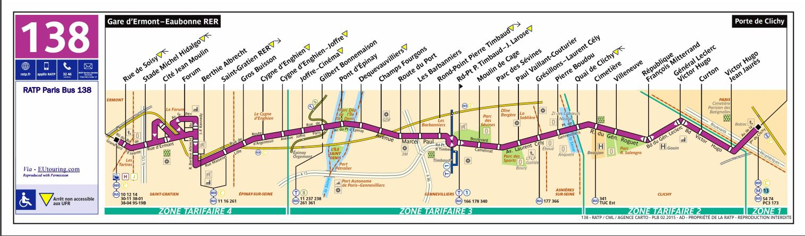
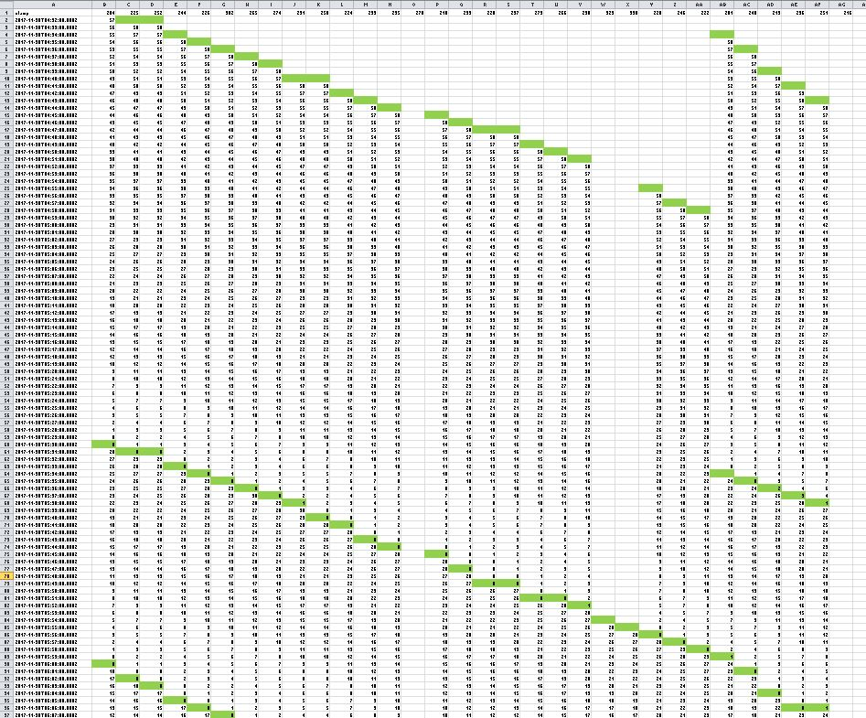
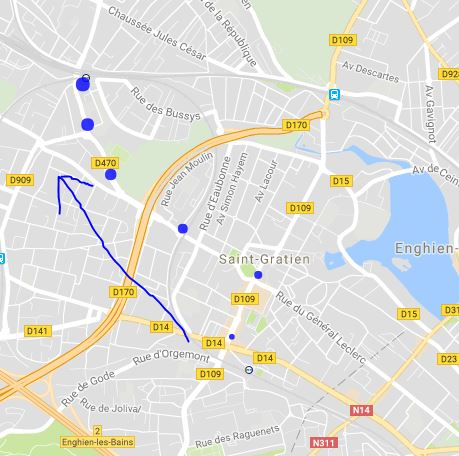
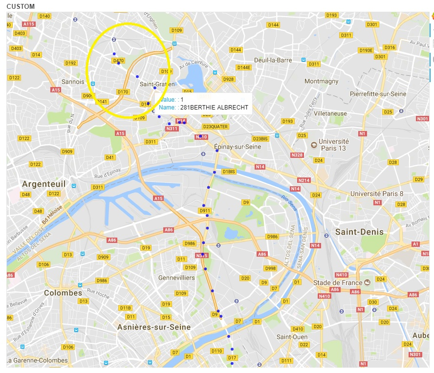
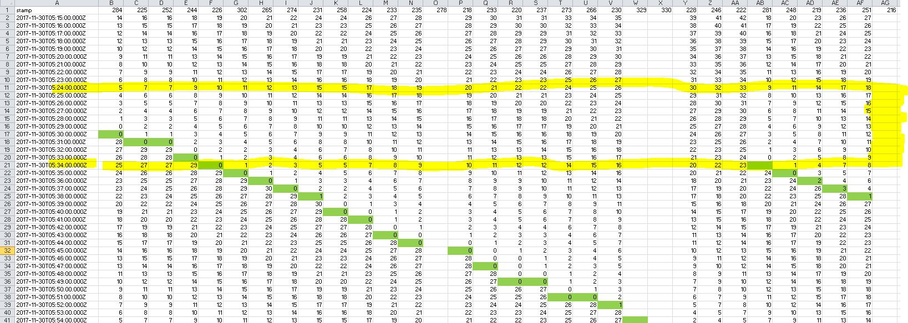

# Project to parse actual timetable data into Alstom Master Model

# Run commands

## Parsing Modules
There are different parsing modules in this project:

* LoadActualTimetable. Parse actual timetable data from PARIS creating table: paris.timetable_actual. To run this project:

		spark-submit --class com.alstom.paris.LoadActualTimetable target\scala-2.11\paris_2.11-1.0.jar Logfile 0 
		
* LoadStops. Parse stops file with BDGEO Ids and creates table paris.bdgeo_stops. This project make use of this [repo](https://github.com/yageek/lambert-java) 
to convert Lambert II Extended into WGS84. To run this project:

		spark-submit --class com.alstom.paris.LoadStops target\scala-2.11\paris_2.11-1.0.jar Logfile 0		

* LoadTheoricalTimetable. Parse theoretical gtfs network info and creates tables.

		spark-submit --class com.alstom.paris.LoadTheoricalTimetable target\scala-2.11\paris_2.11-1.0.jar Logfile 0	
		
* LoadStopsMapping. Create table with the mapping between BDGEO Ids and GTFS Ids.

		spark-submit --class com.alstom.paris.LoadStopsMapping target\scala-2.11\paris_2.11-1.0.jar Logfile 0	

## Analytic Modules		

* DelayGrid. Use table from ActualTimetable module to represent in a grid the delay of every vehicle versus the API query timestamp.

		spark-submit --class com.alstom.paris.analytics.DelayGrid target\scala-2.11\paris_2.11-1.0.jar Logfile 0	
		
* GetAdherence. Use theoretical timetables from module "LoadTheoricalTimetable" and actual timetables from module "ActualTimetable" to
obtain the accuracy of the trips

		spark-submit --class com.alstom.paris.analytics.GetAdherence target\scala-2.11\paris_2.11-1.0.jar Logfile 0

# Parsing Input Data

* Data is captured by API queries

* CSV must be read as TEXT an process every line independently because the separator ";" can be found also in the free text field

* There are four columns: 

	- Date of the API query
	- Time of the API query
	- Sequence of Line+Stop1+Stop2+....+StopN
	- Sequence of Messages. There are two messages for each stop:  Message1_1 + Message1_2 + Message2_1 + Message2_2 + ---- + MessageN_1 + MessageN_2
	
*There are also two types of messages:

- Timestamps messages. On the shape: "null null R 201712220017 17 mn". The letter A/R identifies the direction of the vehicle ("allée"/"return").
	The first sequence of numbers is the estimated time of arrival and the second sequence of numbers is the expected waiting time for the next 
	vehicle to arrive. Those messages come on pairs for every pair. The second timestamp message means exactly the same that the first one but
	 for the following vehicle the the next to arrive, if any. Those messages, besides the waiting time (that can be positive or negative), 
	 can also take the values: "A l'arret" and "A l'approche". Those two non numeric values are parsed as delay=0
	 
- Text messages. on the shape: " null null R null ARRET NON DESSERVI ". This field must be clarified. It can take the values:
	- ..................
	- ARRET NON DESSERVI (*)
	- ARRET REPORTE (*)
	- BUS SUIVANT DEVIE (*)
	- DERNIER PASSAGE
	- DEVIATION (*)
	- INFO INDISPO ....
	- INFO INDISPO....
	- NON COMMENCE
	- PAS DE SERVICE
	- PERTURBATIONS (*)
	- PREMIER PASSAGE
	- SERVICE
	- SERVICE TERMINE
			
* There are those lines:

|  line  |
|-|
| 138    |
| 141    |
| 144    |
| 158    |
| 159    |
| 163    |
| 174    |
| 178    |
| 241    |
| 244    |
| 258    |
| 261    |
| 27     |
| 275    |
| 276    |
| 278    |
| 360    |
| 367    |
| 563    |
| 93     |
| error  |

	 		
# Output Tables							

## paris.timetable_actual
	
Time Data is formated using scala case class:

		case class TimetableActual (
		    stamp: java.sql.Timestamp,
		    line: String,
		    stop: String,
		    direction: String,
		    arrival_time: String,
		    delay: String,
		    message: String,
			next: Boolean,
		    all: String
		)

The last field "all" has only debug purposes and must be removed once that the input data is properly parsed.
The resulting table:

|   col_name    | data_type  | comment  |
|-|-|-|
| stamp         | timestamp  |          |
| line          | int        |          |
| stop          | int        |          |
| direction     | string     |          |
| arrival_time  | timestamp  |          |
| delay         | int        |          |
| next          | Boolean    |          |
| message       | string     |          |

Example:

| timetable_actual.stamp  | timetable_actual.line  | timetable_actual.stop  | timetable_actual.direction  | timetable_actual.arrival_time  | timetable_actual.delay  | timetable_actual.message  |
|-|-|-|-|-|-|-|
| 2017-11-30 00:00:00.0   | 144                    | 70                     | R                           | 2017-11-30 00:06:00.0          | 6                       | NULL                      |
| 2017-11-30 00:00:00.0   | 144                    | 70                     | R                           | 2017-11-30 00:29:00.0          | 29                      | NULL                      |
| 2017-11-30 00:00:00.0   | 144                    | 312                    | A                           | 2017-11-30 00:14:00.0          | 14                      | NULL                      |
| 2017-11-30 00:00:00.0   | 144                    | 312                    | A                           | 2017-11-30 00:40:00.0          | 40                      | NULL                      |
| 2017-11-30 00:00:00.0   | 144                    | 348                    | R                           | 2017-11-30 00:21:00.0          | 21                      | NULL                      |
| 2017-11-30 00:00:00.0   | 144                    | 348                    | R                           | 2017-11-30 00:51:00.0          | 51                      | NULL                      |
| 2017-11-30 00:00:00.0   | 144                    | 303                    | A                           | 2017-11-30 00:12:00.0          | 12                      | NULL                      |
| 2017-11-30 00:00:00.0   | 144                    | 303                    | A                           | 2017-11-30 00:39:00.0          | 39                      | NULL                      |
| 2017-11-30 00:00:00.0   | 144                    | 362                    | R                           | 2017-11-30 00:22:00.0          | 22                      | NULL                      |
| 2017-11-30 00:00:00.0   | 144                    | 362                    | R                           | 2017-11-30 00:52:00.0          | 52                      | NULL                      |

## paris.bdgeo_stops

File is formated according to schema:

|  col_name  | data_type  | comment  |
|-|-|-|
| line       | int        |          |
| stop_name  | string     |          |
| dir        | string     |          |
| lat        | int        |          |
| lon        | int        |          |
| bdgeo      | int        |          |

Example:

| bdgeo_stops.line  | bdgeo_stops.stop_name  | bdgeo_stops.dir  | bdgeo_stops.lat  | bdgeo_stops.lon  | bdgeo_stops.bdgeo  |
|-|-|-|-|-|-|
| 0                 | arret bus inconnu      |                  | NULL             | NULL             | 0                  |
| 101               | arret bus inconnu      |                  | NULL             | NULL             | 0                  |
| 101               | JOINVILLE-LE-PONT RER  | A                | 609383           | 2424708          | 3                  |
| 101               | RESISTANCE             | A                | 609665           | 2424650          | 119                |
| 101               | VERDUN                 | A                | 610116           | 2424611          | 120                |
| 101               | JOUGLA                 | A                | 610074           | 2424967          | 123                |
| 101               | MOZART                 | A                | 610031           | 2425285          | 124                |
| 101               | POLANGIS               | A                | 610201           | 2425495          | 125                |
| 101               | CAMPING INTERNATIONAL  | R                | 610279           | 2425645          | 136                |
| 101               | POLANGIS               | R                | 610192           | 2425471          | 127                |

## paris.gtfs_routes

|     col_name      | data_type  | comment  |
|-|-|-|
| route_id          | string     |          |
| agency_id         | string     |          |
| route_short_name  | string     |          |
| route_long_name   | string     |          |
| route_desc        | string     |          |
| route_type        | int        |          |
| route_url         | string     |          |
| route_color       | string     |          |
| route_text_color  | string     |          |

## paris.gtfs_stop_times

|       col_name       | data_type  | comment  |
|-|-|-|
| trip_id              | string     |          |
| arrival_time         | timestamp  |          |
| departure_time       | timestamp  |          |
| stop_id              | string     |          |
| stop_sequence        | int        |          |
| stop_headsign        | string     |          |
| pickup_type          | int        |          |
| drop_off_type        | int        |          |
| shape_dist_traveled  | double     |          |

## paris.gtfs_stops

|       col_name       | data_type  | comment  |
|-|-|-|
| stop_id              | string     |          |
| stop_code            | string     |          |
| stop_name            | string     |          |
| stop_desc            | string     |          |
| stop_lat             | double     |          |
| stop_lon             | double     |          |
| zone_id              | string     |          |
| stop_url             | string     |          |
| location_type        | int        |          |
| parent_station       | string     |          |
| stop_timezone        | string     |          |
| wheelchair_boarding  | int        |          |

## paris.gtfs_trips

|        col_name        | data_type  | comment  |
|-|-|-|
| route_id               | string     |          |
| service_id             | string     |          |
| trip_id                | string     |          |
| trip_headsign          | string     |          |
| trip_short_name        | string     |          |
| direction_id           | int        |          |
| block_id               | string     |          |
| shape_id               | string     |          |
| wheelchair_accessible  | int        |          |

# Unparsed messages

There are some 16512 uninformative messages (empty or API errors) that must be ignored. Those messages are parsed with the "error" keyword on 
every column and the original string on the message field.

| 2017-12-22 02:04:00.0| error| error | error | error | error | "" 

# Understanding service lines

Let's choose line 138 with stops:

		  SELECT A.stop, B.stop_name FROM
		 (SELECT DISTINCT stop AS stop, 138 AS line 
		  FROM timetable_actual 
		  WHERE line=138) A 
		  INNER JOIN 
		  bdgeo_stops B 
		  WHERE 
		  A.line=B.line 
		  AND
		  A.stop=B.bdgeo ;

| a.stop  |             b.stop_name             |
|-|-|
| 216     | GARE D'ERMONT EAUBONNE-RER          |
| 218     | ROND POINT PIERRE TIMBAUD           |
| 219     | CITE JEAN MOULIN                    |
| 220     | ROUTE DU PORT                       |
| 222     | GARE DE SAINT GRATIEN               |
| 224     | PAUL VAILLANT COUTURIER             |
| 225     | VICTOR HUGO-JEAN JAURES             |
| 226     | REPUBLIQUE-FRANCOIS MITTERRAND      |
| 228     | CYGNE D'ENGHIEN                     |
| 230     | GILBERT BONNEMAISON                 |
| 231     | PIERRE BOUDOU                       |
| 233     | PARC DES SEVINES                    |
| 235     | MOULIN DE CAGE                      |
| 236     | STADE MICHEL HIDALGO                |
| 237     | CHAMPS FOURGONS                     |
| 238     | PIERRE BOUDOU                       |
| 239     | GILBERT BONNEMAISON                 |
| 241     | STADE MICHEL HIDALGO                |
| 244     | GENERAL LECLERC-VICTOR HUGO         |
| 246     | GROS BUISSON                        |
| 248     | FORUM                               |
| 251     | RUE DE SOISY                        |
| 252     | CURTON                              |
| 254     | PARC DES SEVINES                    |
| 255     | FORUM                               |
| 257     | GROS BUISSON                        |
| 258     | GRESILLONS-LAURENT CELY             |
| 259     | CHAMPS FOURGONS                     |
| 261     | MOULIN DE CAGE                      |
| 263     | CURTON                              |
| 265     | CIMETIERE                           |
| 266     | PONT D'EPINAY                       |
| 268     | ROUTE DU PORT                       |
| 270     | GENERAL LECLERC-VICTOR HUGO         |
| 272     | PAUL VAILLANT COUTURIER             |
| 273     | DEQUEVAUVILLIERS                    |
| 274     | QUAI DE CLICHY                      |
| 275     | CITE JEAN MOULIN                    |
| 276     | CIMETIERE                           |
| 277     | RUE DE SOISY                        |
| 278     | ROND-POINT PIERRE TIMBAUD-J.LAROSE  |
| 280     | VICTOR HUGO-JEAN JAURES             |
| 281     | BERTHIE ALBRECHT                    |
| 284     | PORTE DE CLICHY-METRO               |
| 287     | REPUBLIQUE-FRANCOIS MITTERRAND      |
| 291     | DEQUEVAUVILLIERS                    |
| 293     | LES BARBANNIERS                     |
| 295     | LES BARBANNIERS                     |
| 297     | GRESILLONS-LAURENT CELY             |
| 298     | PONT D'EPINAY                       |
| 300     | QUAI DE CLICHY                      |
| 302     | VILLENEUVE                          |
| 303     | CYGNE D'ENGHIEN                     |
| 305     | VILLENEUVE                          |
| 307     | BERTHIE ALBRECHT                    |
| 309     | GARE DE SAINT GRATIEN               |
| 321     | ROND POINT PIERRE TIMBAUD           |
| 329     | JOFFRE CINEMA                       |
| 330     | CYGNE D'ENGHIEN-JOFFRE              |
| 331     | CYGNE D'ENGHIEN-JOFFRE              |
| 332     | JOFFRE CINEMA                       |

The official stops schema is:

Comparing stops in both directions: 

| GO  |			|RETURN  |
|-|-|-|
| 218   |		| 216   |
| 219   |		| 225   |
| 220   |		| 226   |
| 222   |		| 231   |
| 224   |		| 238   |
| 225   |		| 239   |
| 226   |		| 241   |
| 228   |		| 244   |
| 230   |		| 252   |
| 231   |		| 254   |
| 233   |		| 255   |
| 235   |		| 257   |
| 236   |		| 258   |
| 237   |		| 259   |
| 244   |		| 261   |
| 246   |		| 263   |
| 248   |		| 268   |
| 251   |		| 270   |
| 252   |		| 272   |
| 258   |		| 275   |
| 265   |		| 276   |
| 266   |		| 277   |
| 273   |		| 278   |
| 274   |		| 280   |
| 281   |		| 281   |
| 284   |		| 287   |
| 293   |		| 291   |
| 302   |		| 295   |
| 329   |		| 297   |
| 330   |		| 298   |
|  		|		| 300   |
|  		|		| 303   |
|  		|		| 305   |
|  		|		| 307   |
|  		|		| 309   |
|  		|		| 321   |
|  		|		| 329   |
|  		|		| 331   |
|  		|		| 332   |

We have detected stopIDs that appear in both directions: 225,226,231,244,252,258 and 281. Those stops are IDs from the GO direction that
appear rarely in the RETURN direction. It remains to find out if this is a bug or it has a meaning. 

# Analytics 

## Display DELAYS per TRIP.

This has been implemented in DelayGrid.scala project resulting in this [file](resources/grid.csv). 
To get this grid, it's a must to have the stops properly ordered. This ranging is not easily extracted from actual_timetable info.
So the stops order has been obtain by quering the API. In the case of the line 138 it was:

		val stops=Array(284,225,252,244,226,302,265,274,231,258,224,233,235,278,218,293,220,237,273,266,230,329,330,228,246,222,281,248,219,236,251,216)

Adding some conditional formating
we can get an approach of all [trips](resources/grid.xlsx) :

## Get Adherence.

 To compute the adherence we need to use theoretical gtfs data and actual timetable data.
 
 From the gtfs_routes table we can get the rout_id corresponding to a bus line:
 
		select * from gtfs_routes where route_short_name=138;

| gtfs_routes.route_id  | gtfs_routes.agency_id  | gtfs_routes.route_short_name  | gtfs_routes.route_long_name  | gtfs_routes.route_desc  | gtfs_routes.route_type  | gtfs_routes.route_url  | gtfs_routes.route_color  | gtfs_routes.route_text_color  |
|-|-|-|-|-|-|-|-|-|
| 100100138:138         | 442                    | 138                           | 138                          | null                    | 3                       | null                   | BB4D98                   | FFFFFF                        |

 With this route_id, we can search in gtfs_trips table its different instances and chose one. This is supposed to be
 a trip for bus 138, in a particular direction and particular departure time. Be aware that service_id has to be coherent with the actual_timetable data.
 That means if actual_timetable is parsed for 2017 November the 30th (Thursday), the service ID has to be chosen to be coherent with this data. In this case
 we have chosen 2000 as per calendar.txt file:
 
 |service_id|monday|tuesday|wednesday|thursday|friday|saturday|sunday|start_date|end_date|
 |-|-|-|-|-|-|-|-|-|-|
 |2000|1|1|1|1|1|0|0|20171129|20171222|
 
 So, query will be:

		select * from gtfs_trips where route_id="100100138:138" and service_id=2000;
		

| gtfs_trips.route_id  | gtfs_trips.service_id  | gtfs_trips.trip_id  | gtfs_trips.trip_headsign  | gtfs_trips.trip_short_name  | gtfs_trips.direction_id  | gtfs_trips.block_id  | gtfs_trips.shape_id  | gtfs_trips.wheelchair_accessible  |
|-|-|-|-|-|-|-|-|-|
| 100100138:138        | 2000                   | 87863614-1_73001    | 87863614                  | null                        | 0                        | null                 | null                 | 1                                 |
| 100100138:138        | 2000                   | 87863618-1_73002    | 87863618                  | null                        | 0                        | null                 | null                 | 1                                 |
| 100100138:138        | 2000                   | 87863622-1_73003    | 87863622                  | null                        | 0                        | null                 | null                 | 1                                 |
| 100100138:138        | 2000                   | 87863609-1_72999    | 87863609                  | null                        | 0                        | null                 | null                 | 1                                 |
| 100100138:138        | 2000                   | 87863612-1_73000    | 87863612                  | null                        | 1                        | null                 | null                 | 1                                 |

Let's choose for example, trip_id = "87863614-1_73001".

Now, with the trip_id, we can find all the stops attached to this trip.

		select * from gtfs_stop_times where trip_id="87863614-1_73001";

| gtfs_stop_times.trip_id  | gtfs_stop_times.arrival_time  | gtfs_stop_times.departure_time  | gtfs_stop_times.stop_id  | gtfs_stop_times.stop_sequence  | gtfs_stop_times.stop_headsign  | gtfs_stop_times.pickup_type  | gtfs_stop_times.drop_off_type  | gtfs_stop_times.shape_dist_traveled  |
|-|-|-|-|-|-|-|-|-|
| 87863614-1_73001         | 1970-01-01 05:24:00.0         | 1970-01-01 05:24:00.0           | StopPoint:59:5081769     | 0                              | None                           | 0                            | 0                              | NULL                                 |
| 87863614-1_73001         | 1970-01-01 05:26:00.0         | 1970-01-01 05:26:00.0           | StopPoint:59:5081771     | 1                              | None                           | 0                            | 0                              | NULL                                 |
| 87863614-1_73001         | 1970-01-01 05:29:00.0         | 1970-01-01 05:29:00.0           | StopPoint:59:5081773     | 2                              | None                           | 0                            | 0                              | NULL                                 |
| 87863614-1_73001         | 1970-01-01 05:31:00.0         | 1970-01-01 05:31:00.0           | StopPoint:59:5081775     | 3                              | None                           | 0                            | 0                              | NULL                                 |
| 87863614-1_73001         | 1970-01-01 05:33:00.0         | 1970-01-01 05:33:00.0           | StopPoint:59:5081777     | 4                              | None                           | 0                            | 0                              | NULL                                 |
| 87863614-1_73001         | 1970-01-01 05:34:00.0         | 1970-01-01 05:34:00.0           | StopPoint:59:5081779     | 5                              | None                           | 0                            | 0                              | NULL                                 |

Joining with the gtfs_stops table and using the plotwithquery.py script:

		>spark-submit plotwithquery.py C:\tmp 0.1 select 1 as time, B.stop_lat as y, B.stop_lon as x, A.stop_id as name, (A.stop_sequence+1) as value from (select stop_id, stop_sequence from paris.gtfs_stop_times where trip_id='87863618-1_73002') A LEFT JOIN paris.gtfs_stops B ON A.stop_id = B.stop_id

| time  |     y      |     x     |         name          | value  |
|-|-|-|-|-|
| 1     | 48.965912  | 2.28377   | StopPoint:59:5081769  | 0      |
| 1     | 48.969399  | 2.286032  | StopPoint:59:5081771  | 1      |
| 1     | 48.972003  | 2.279559  | StopPoint:59:5081773  | 2      |
| 1     | 48.975055  | 2.273372  | StopPoint:59:5081775  | 3      |
| 1     | 48.977867  | 2.271389  | StopPoint:59:5081777  | 4      |
| 1     | 48.980131  | 2.270976  | StopPoint:59:5081779  | 5      |

This gives the picture (the arrow shows the direction of the trip):

On the other side, if we plot all the stops for the same line and the same direction from the actual_timetable table: 

		> spark-submit plotwithquery.py C:\tmp 0.1  SELECT 1 as time, lat as y, lon as x, bdgeo as value, stop_name as name FROM paris.bdgeo_stops WHERE line=138 and dir='A'

This query strangely does not provides actual arrival times for the stop GARE D'ERMONT EAUBONNE-RER (bdgeo id:216)
	
We can manually match:

		StopPoint:59:5081769 --> 281					
		StopPoint:59:5081771 --> 248
		StopPoint:59:5081773 --> 219
		StopPoint:59:5081775 --> 236
		StopPoint:59:5081777 --> 251
		StopPoint:59:5081779 --> 216

A new issue is the complexity matching the theoretical timetables:

| gtfs_stop_times.arrival_time  | gtfs_stop_times.stop_id  | gtfs_stop_times.stop_sequence  |
|-|-|-|
| 1970-01-01 05:24:00.0         | StopPoint:59:5081769     | 0                              |
| 1970-01-01 05:26:00.0         | StopPoint:59:5081771     | 1                              |
| 1970-01-01 05:29:00.0         | StopPoint:59:5081773     | 2                              |
| 1970-01-01 05:31:00.0         | StopPoint:59:5081775     | 3                              |
| 1970-01-01 05:33:00.0         | StopPoint:59:5081777     | 4                              |
| 1970-01-01 05:34:00.0         | StopPoint:59:5081779     | 5                              |

 with the actual ones:
 
 

	
# Scala Tips

When using spark-shell do not forget to run:

	import java.util.TimeZone
	TimeZone.setDefault(TimeZone.getTimeZone("UTC"))
	
So that Timestamps are properly displayed.
